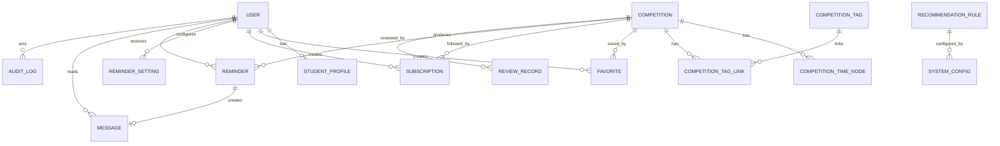
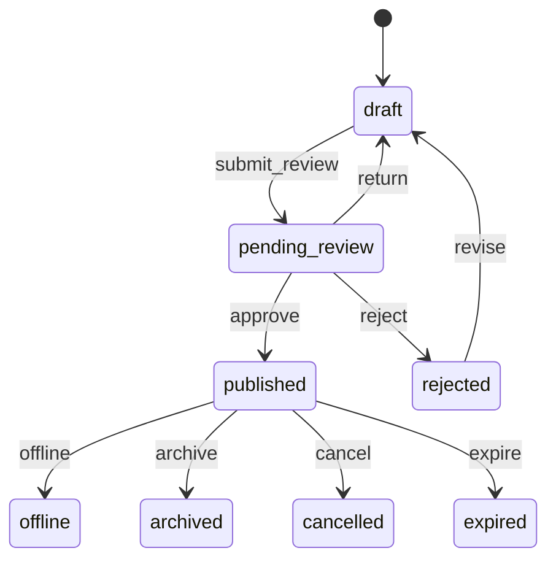
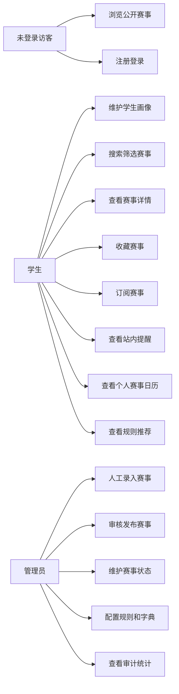

# 1．引言

## 1.1 编写目的

本文档用于明确“大学生竞赛信息智能筛选与推荐系统”的业务目标、用户角色、数据对象、功能需求、非功能需求和约束条件，为后续设计、开发、测试和课程答辩提供依据。

本文档不是对所有后续扩展能力的无限承诺。当前版本以学生发现和跟进赛事、管理员维护和审核赛事为核心，M1-M6 为当前核心交付范围，M7 内容沉淀与交流扩展作为后续扩展。

## 1.2 项目背景

| 项目项 | 内容 |
|---|---|
| 委托单位 | 软件工程课程设计课程组 |
| 开发单位 | 第七组 |
| 主管部门 | 学院或课程教学管理单位 |
| 系统名称 | 大学生竞赛信息智能筛选与推荐系统 |
| 英文短名 | CompeteHub |

在校本科生通常通过学校官网、学院通知、竞赛官网、公众号、班级群和同学转发等方式获取赛事信息。由于信息分散、格式不统一、节点难跟进，学生难以快速判断某项赛事是否适合自己的专业、年级、兴趣和参赛目标，也容易错过报名、作品提交和比赛开始等关键时间。

本系统提供统一的可信赛事信息管理和学生端发现跟进能力。管理员从可信来源人工录入赛事，经审核后发布到前台；学生可搜索筛选赛事、查看详情、收藏或订阅赛事，并通过站内提醒和个人赛事日历跟进关键节点；系统根据学生画像和赛事字段提供规则推荐及推荐理由。

## 1.3 定义

| 术语 | 定义 |
|---|---|
| 赛事 | 系统中被录入、审核、发布、搜索、收藏、订阅和推荐的核心业务对象。 |
| 学生 | 当前核心用户角色，使用学生端查找、判断和跟进赛事。 |
| 管理员 | 当前后台角色，负责赛事治理、配置管理、审计统计和用户管理。 |
| 辅助干系人 | 教师、教学秘书、竞赛组织者、学生社团等影响需求但当前不具备独立工作台的对象。 |
| 学生画像 | 学生的学院、专业、年级、兴趣方向、竞赛经历和目标偏好等信息。 |
| 可信来源 | 学校官网、学院公告、竞赛官网、官方通知等可追溯信息来源。 |
| 人工录入 | 管理员从可信来源创建结构化赛事记录的当前版本方式。 |
| 审核发布 | 管理员核对赛事来源、字段和节点后发布或驳回的流程。 |
| 收藏 | 学生保存赛事以便后续查看，不直接生成提醒。 |
| 订阅 | 学生持续跟进赛事节点，可生成站内提醒和个人赛事日历节点。 |
| 站内提醒 | 系统内消息提醒，不包含邮件、短信、微信等外部推送。 |
| 规则推荐 | 基于明确规则的赛事推荐，不公开赛事价值评分。 |
| 推荐理由 | 系统展示的可解释推荐原因，来源于规则或赛事字段。 |
| 价值依据说明 | 辅助学生判断赛事是否值得关注的来源事实、标签和说明，不替代官方认定。 |

## 1.4 参考资料

| 资料 | 说明 |
|---|---|
| `CONTEXT.md` | 项目领域语言和术语。 |
| `docs/PRD.zh.md` | 产品需求和业务边界。 |
| `docs/roadmap.md` | 工程开发路线。 |
| `docs/architecture.md` | 系统架构和数据流。 |
| `docs/api_spec.md` | REST API 契约。 |
| `docs/data_model.md` | 数据模型和状态规则。 |
| `docs/tech_spec.zh.md` | 技术实现规格。 |
| `docs/reports/module_breakdown_v1.0.md` | 模块划分和职责。 |

# 2．总体概述

## 2.1 软件介绍

大学生竞赛信息智能筛选与推荐系统是面向在校本科生的赛事发现、筛选、推荐和跟进平台。系统通过管理员维护可信赛事数据，降低学生查找和判断赛事的成本，并通过订阅、站内提醒和个人赛事日历减少学生错过关键节点的风险。

系统强调三个原则：

- 可信：赛事必须保留来源名称和来源链接，发布前经过审核。
- 可解释：推荐来自明确规则和赛事字段，不公开不可追溯的价值评分。
- 可跟进：订阅赛事后，关键时间节点可以生成站内提醒和日历节点。

## 2.2 软件功能概述

当前核心交付范围采用七模块划分，其中 M1-M6 为当前核心，M7 为扩展预留。

| 模块 | 名称 | 当前范围 |
|---|---|---|
| M1 | 用户与画像管理 | 注册登录、账号状态、学生画像、推荐与提醒偏好。 |
| M2 | 赛事治理 | 人工录入、编辑维护、提交审核、审核发布、状态管理。 |
| M3 | 赛事发现与展示 | 搜索、筛选、排序、列表、详情、适配标签、价值依据、官方通道。 |
| M4 | 赛事跟进 | 收藏、订阅、站内提醒、消息中心、个人赛事日历。 |
| M5 | 规则推荐与推荐解释 | 规则推荐、排序、推荐理由、解释一致性校验。 |
| M6 | 后台运营、配置与审计统计 | 用户管理、基础配置、审核记录、审计日志、基础统计。 |
| M7 | 内容沉淀与交流扩展 | 资料归档、组队交流、认证答疑、赛后复盘，当前作为后续扩展。 |

## 2.3 用户特征

| 用户 | 特征 | 主要目标 |
|---|---|---|
| 未登录访客 | 初次访问系统，可能不了解系统价值。 | 浏览公开赛事列表和详情，判断是否注册使用。 |
| 学生 | 在校本科生，关注赛事是否适合自己的专业、年级、兴趣和目标。 | 快速找到适合赛事，收藏或订阅，并跟进关键节点。 |
| 管理员 | 具备后台权限，负责赛事数据质量和系统运营。 | 录入并审核赛事，维护状态、配置、用户和审计记录。 |
| 辅助干系人 | 教师、教学秘书、竞赛组织者、学生社团。 | 关注赛事信息准确性、宣传触达和学生参与情况。 |

当前版本正式角色为学生和管理员。教师、教学秘书和竞赛组织者作为辅助干系人或预留角色，不提供独立工作台。

## 2.4 运行环境

| 类型 | 要求 |
|---|---|
| 客户端 | 主流桌面浏览器，核心学生流程适配移动端浏览。 |
| 前端 | Vue 3、Vite、TypeScript、Pinia、Vue Router。 |
| 后端 | Flask、SQLAlchemy、Marshmallow、Celery。 |
| 数据库 | PostgreSQL。 |
| 缓存和任务队列 | Redis。 |
| 本地部署 | Docker Compose、just、uv、npm。 |
| 文档 | MkDocs Material。 |

# 3．数据描述

## 3.1 数据建模

核心数据模型如下：

主要状态模型：

## 3.2 数据字典

| 数据对象 | 关键字段 | 说明 |
|---|---|---|
| `users` | `id`、`email`、`phone`、`student_no`、`display_name`、`role`、`status` | 账号身份、角色和状态。 |
| `student_profiles` | `user_id`、`college`、`major`、`grade`、`interest_tags`、`competition_experience`、`goal_preferences` | 学生画像和推荐输入。 |
| `competitions` | `title`、`short_title`、`category`、`organizer`、`source_name`、`source_url`、`official_url`、`summary`、`detail`、`status` | 赛事主体信息、来源和发布状态。 |
| `competition_time_nodes` | `competition_id`、`node_type`、`starts_at`、`due_at`、`description` | 报名开始、报名截止、作品提交截止、比赛开始等节点。 |
| `competition_tags` | `code`、`name`、`tag_type`、`description` | 参考标签、适配标签、类别标签等。 |
| `competition_tag_links` | `competition_id`、`tag_id` | 赛事和标签关系。 |
| `favorites` | `user_id`、`competition_id`、`is_active` | 学生收藏赛事记录。 |
| `subscriptions` | `user_id`、`competition_id`、`status`、`reminder_enabled`、`remind_days`、`node_types` | 学生订阅赛事和提醒偏好覆盖。 |
| `reminder_settings` | `user_id`、`enabled`、`default_remind_days`、`node_types` | 用户默认提醒设置。 |
| `reminders` | `user_id`、`competition_id`、`time_node_id`、`node_type`、`due_at`、`title`、`status` | 待发送、已发送、取消或失败的提醒计划。 |
| `messages` | `user_id`、`reminder_id`、`title`、`body`、`is_read`、`read_at` | 站内消息。 |
| `review_records` | `target_type`、`target_id`、`submitted_by_id`、`reviewed_by_id`、`status`、`comment` | 审核对象、结果和意见。 |
| `audit_logs` | `actor_id`、`action`、`target_type`、`target_id`、`result`、`detail` | 后台关键操作日志。 |
| `recommendation_rules` | `code`、`name`、`weight`、`conditions`、`reason_template`、`enabled` | 规则推荐配置和推荐理由模板。 |
| `system_configs` | `key`、`value`、`description` | 基础字典、消息模板、推荐权重等配置。 |

# 4．功能需求

## 4.1 功能需求概要

系统主要用例如下：

## 4.2 功能需求详细说明

### FR1 用户注册登录与画像维护

| 项 | 内容 |
|---|---|
| 目标 | 支持学生注册登录并维护画像，为搜索默认项、推荐和提醒提供基础数据。 |
| 参与者 | 学生、未登录访客。 |
| 前置条件 | 用户未登录或已登录；系统可校验账号唯一性。 |
| 主流程 | 用户注册或登录；系统校验账号和密码；学生进入个人中心；维护学院、专业、年级、兴趣方向、竞赛经历、目标偏好和提醒偏好。 |
| 异常流程 | 账号重复、密码错误、账号禁用、画像字段不合法、保存失败。 |
| 验收标准 | 学号、邮箱、手机号唯一；登录后能访问个人中心；画像保存后可被推荐和筛选读取。 |

### FR2 赛事人工录入、审核与状态管理

| 项 | 内容 |
|---|---|
| 目标 | 保证前台展示的赛事来自可信来源，字段完整，状态可追踪。 |
| 参与者 | 管理员。 |
| 前置条件 | 管理员已登录后台；基础字典可用。 |
| 主流程 | 管理员新建赛事并填写来源、主办方、时间节点、报名条件、官方链接、附件和适配字段；保存草稿或提交审核；审核人核对后通过、驳回或退回修改；已发布赛事进入前台可见范围。 |
| 异常流程 | 来源缺失、时间冲突、链接格式错误、重复赛事提示、状态已被他人变更。 |
| 验收标准 | 草稿、待审核、驳回、下架赛事不在默认前台列表展示；审核和状态变更写入审计记录。 |

### FR3 赛事搜索、筛选、排序与列表展示

| 项 | 内容 |
|---|---|
| 目标 | 帮助学生在少量操作内找到符合条件的赛事。 |
| 参与者 | 学生、未登录访客。 |
| 前置条件 | 系统存在已发布赛事。 |
| 主流程 | 用户输入关键词；选择专业、年级、类别、标签、报名状态、截止日期、参赛形式等筛选条件；系统返回分页列表；用户按截止时间、发布时间、推荐度或热度排序。 |
| 异常流程 | 无结果、筛选字典加载失败、推荐度排序降级。 |
| 验收标准 | 搜索结果默认只包含已发布且未下架赛事；筛选条件可清除；分页不重复展示赛事。 |

### FR4 赛事详情、适配标签、价值依据与官方通道

| 项 | 内容 |
|---|---|
| 目标 | 帮助学生在详情页判断赛事是否适合报名或订阅。 |
| 参与者 | 学生、未登录访客。 |
| 前置条件 | 赛事处于可查看状态。 |
| 主流程 | 用户进入详情页；查看简介、来源、主办方、报名条件、时间节点、参赛形式、材料要求、附件、适配标签、价值依据说明和官方链接；点击官方通道跳转。 |
| 异常流程 | 赛事已下架、官方链接缺失、附件失效、赛事已取消或过期。 |
| 验收标准 | 详情页必须展示来源标识和更新时间；价值依据仅作参考，不展示公开赛事价值分数。 |

### FR5 收藏订阅、站内提醒与个人赛事日历

| 项 | 内容 |
|---|---|
| 目标 | 支持学生跟进感兴趣赛事，减少错过关键节点的风险。 |
| 参与者 | 学生。 |
| 前置条件 | 学生已登录；赛事可见。 |
| 主流程 | 学生收藏或取消收藏赛事；订阅或取消订阅赛事；系统根据订阅和时间节点生成提醒；到达触发时间后生成站内消息；个人赛事日历展示订阅赛事节点。 |
| 异常流程 | 未登录、赛事过期、重复订阅、赛事下架、节点修改、用户关闭提醒。 |
| 验收标准 | 收藏和订阅状态独立；取消订阅后取消未来未发送提醒；站内提醒至少覆盖报名截止、作品提交截止和比赛开始。 |

### FR6 规则推荐与推荐解释

| 项 | 内容 |
|---|---|
| 目标 | 根据学生画像和赛事字段提供可解释的赛事推荐。 |
| 参与者 | 学生、未登录访客。 |
| 前置条件 | 存在已发布赛事；推荐规则可用。 |
| 主流程 | 系统读取学生专业、年级、兴趣标签、目标偏好和赛事标签；按规则计算推荐排序；展示推荐赛事和最多三个主要推荐理由。 |
| 异常流程 | 未登录或画像不足时展示通用推荐；匹配不足时补充近期可报名赛事；推荐服务失败时不影响基础搜索。 |
| 验收标准 | 推荐理由来自明确规则或赛事字段；不依赖机器学习模型作为当前实现前提；不展示公开赛事价值评分。 |

### FR7 后台运营、配置与审计统计

| 项 | 内容 |
|---|---|
| 目标 | 支撑管理员管理用户、配置基础字典、查看审核记录、查询审计日志和基础统计。 |
| 参与者 | 管理员。 |
| 前置条件 | 管理员已登录后台。 |
| 主流程 | 管理员查看用户列表，启用或禁用账号，维护赛事类别、参考标签、适合专业、适合年级、推荐权重、消息模板，查看审核记录、审计日志和基础统计。 |
| 异常流程 | 权限不足、配置值不合法、统计数据加载失败。 |
| 验收标准 | 后台接口必须鉴权；关键操作必须记录操作人、时间、对象、结果和详情。 |

### FR8 内容沉淀与交流扩展

| 项 | 内容 |
|---|---|
| 目标 | 为后续资料归档、组队交流、认证答疑和赛后复盘预留扩展方向。 |
| 当前状态 | 低优先级，非当前验收主线。 |
| 约束 | 后续扩展应复用用户、赛事、审核记录和审计日志，不形成独立内容孤岛。 |

## 4.3 功能需求分级

| 优先级 | 范围 | 功能 |
|---|---|---|
| 高 | 当前核心交付 | 注册登录、学生画像、赛事人工录入、审核发布、状态管理、搜索筛选、赛事详情、收藏订阅、站内提醒、个人赛事日历、规则推荐和推荐理由。 |
| 中 | 增强治理与体验 | 统计分析、配置细化、推荐偏好调整、不感兴趣反馈、增强后台治理、更多排序和筛选优化。 |
| 低 | 后续扩展 | M7 内容沉淀与交流扩展、半自动采集候选、外部提醒、模型推荐、教师或组织者独立工作台。 |

# 5．非功能需求

| 编号 | 类型 | 需求 |
|---|---|---|
| NFR1 | 性能 | 常规赛事列表、搜索、筛选和详情页响应时间不超过 3 秒；推荐失败不阻塞基础列表。 |
| NFR2 | 数据时效性 | 审核通过的赛事应立即或近实时可见；状态变更后列表、详情、推荐和提醒同步更新。 |
| NFR3 | 易用性 | 搜索、筛选、详情、收藏、订阅和消息查看路径清晰；空状态和错误状态提供明确提示。 |
| NFR4 | 安全性 | 账号、画像、收藏、订阅和消息属于个人数据；后台接口必须鉴权；普通用户不能访问后台能力。 |
| NFR5 | 可靠性 | 提醒生成避免重复和遗漏；节点修改、赛事取消或下架时取消或重算未发送提醒。 |
| NFR6 | 兼容性 | 学生端兼容主流桌面浏览器，并适配移动端核心流程；后台优先桌面端。 |
| NFR7 | 可维护性 | 赛事类别、标签、专业、年级、推荐规则权重、消息模板可配置；业务规则集中在服务层。 |
| NFR8 | 可扩展性 | 后续扩展应复用账号、赛事、审核和审计体系，避免割裂设计。 |
| NFR9 | 可解释性 | 推荐理由必须可追溯到规则或赛事字段，不展示不可追溯的绝对价值结论。 |

非功能需求需要配套可执行验证方式。权限安全通过 API 权限用例和角色切换检查验证；
数据时效性、可靠性和幂等性通过服务层或 API 状态流转用例验证；性能先采用带种子
数据规模说明的本地 smoke 记录验证列表、搜索和详情页 3 秒目标；易用性通过学生和
管理员主流程手工验收脚本验证；可维护性通过 `just check`、PR 检查清单和文档同步
记录验证。完整测试层级和非功能验证模型见 `docs/testing.md`。

# 6．约束条件

## 6.1 业务约束

- 当前版本赛事数据来自管理员人工录入，不承诺自动采集和自动发布。
- 赛事必须保留可信来源名称和来源链接。
- 价值依据说明只作选赛参考，不替代学校、学院或赛事官方认定。
- 当前版本只承诺学生和管理员两个正式角色。
- M7 内容沉淀与交流扩展不作为当前验收主线。

## 6.2 硬件约束

- 本地开发环境应能运行前端、后端、PostgreSQL 和 Redis。
- 推荐开发设备内存不低于 8GB。
- 当前阶段不要求专用服务器或高可用集群。

## 6.3 软件约束

- 前端使用 Vue 3、Vite、TypeScript、Pinia 和 Vue Router。
- 后端使用 Flask、SQLAlchemy、Marshmallow、Celery。
- PostgreSQL 是核心业务数据事实来源。
- Redis 只用于缓存、限流、Celery broker、短期任务状态和幂等锁，不保存核心业务事实。
- API 使用 `/api/v1` 前缀和统一响应结构。

## 6.4 其他约束

- 外部报名链接、附件和通知页面由官方站点维护，系统只记录和跳转，不保证外站可用性。
- 当前版本不接入邮件、短信、微信、企业微信或小程序推送。
- 当前版本不公开赛事价值评分，不以机器学习模型作为推荐前提。
- 文档、API、模块和数据模型发生实质变化时应同步更新相关文档。
