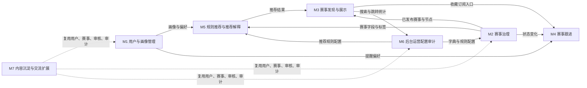
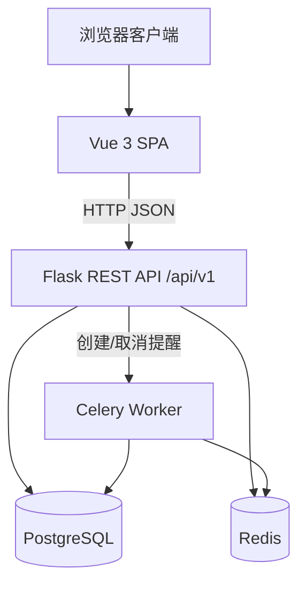
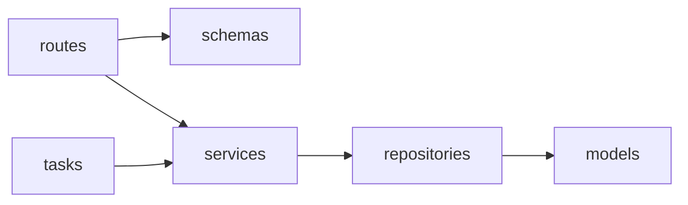
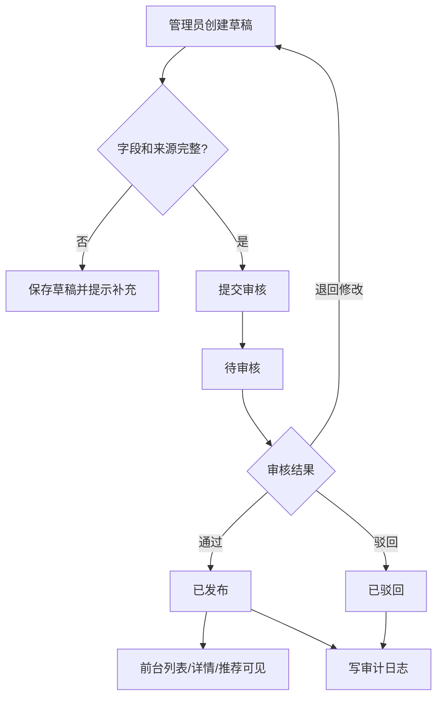
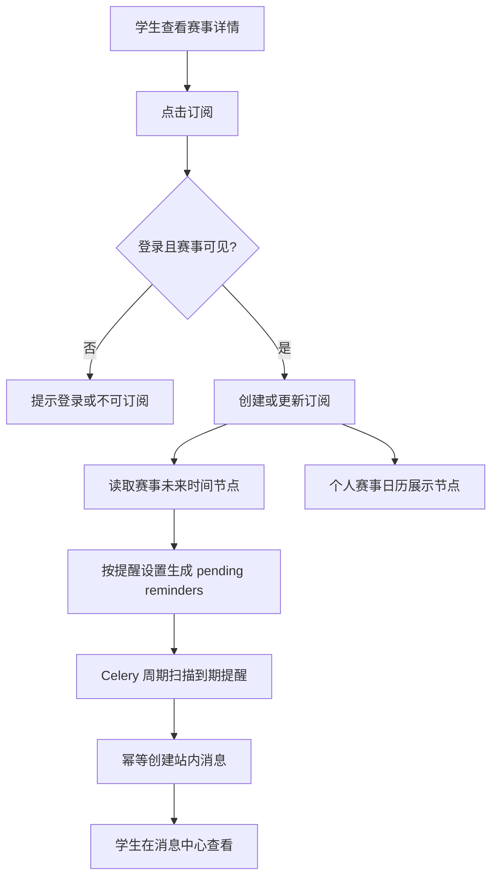
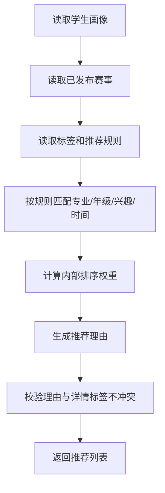
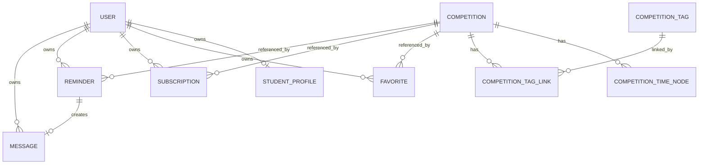
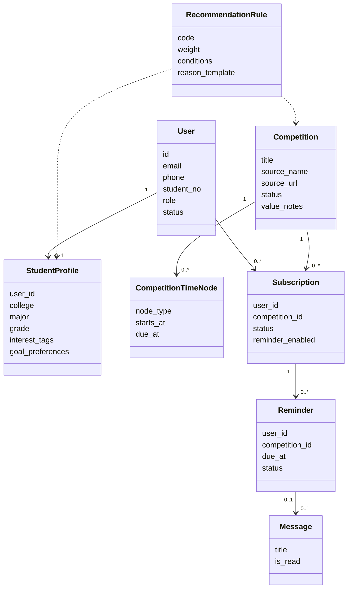
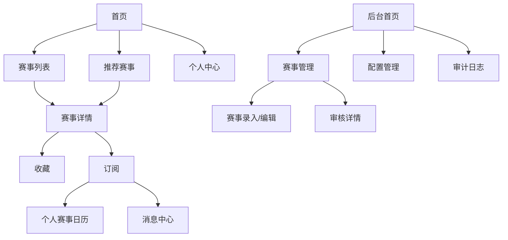

# 1．引言

## 1.1 编写目的

本文档用于说明“大学生竞赛信息智能筛选与推荐系统”的概要设计、系统结构、处理流程、数据库设计、接口设计、模块详细设计、界面设计和出错处理设计。文档面向课程指导教师、项目组成员、开发人员、测试人员和后续维护人员。

本设计说明以当前核心范围为边界：M1-M6 是当前核心交付，M7 内容沉淀与交流扩展作为后续扩展预留。

## 1.2 项目背景

| 项目项 | 内容 |
|---|---|
| 委托单位 | 软件工程课程设计课程组 |
| 开发单位 | 第七组 |
| 主管部门 | 学院或课程教学管理单位 |
| 系统名称 | 大学生竞赛信息智能筛选与推荐系统 |
| 英文短名 | CompeteHub |

系统面向在校本科生赛事发现与跟进场景，解决赛事信息分散、筛选成本高、适配判断困难、关键节点容易遗漏等问题。管理员从可信来源人工录入赛事，经审核后发布；学生通过搜索筛选、详情查看、收藏订阅、站内提醒、个人赛事日历和规则推荐完成选赛与跟进。

## 1.3 定义

| 术语 | 定义 |
|---|---|
| 赛事 | 系统核心业务对象，对应后端 `Competition`。 |
| 学生画像 | 学生专业、年级、兴趣、经历、目标偏好等推荐和筛选输入。 |
| 规则推荐 | 基于显式规则、标签和权重的可解释推荐，不公开赛事价值评分。 |
| 站内提醒 | 系统内部消息提醒，不包含外部推送渠道。 |
| 赛事治理 | 管理员人工录入、编辑、提交审核、审核发布和状态维护。 |
| 审计日志 | 后台关键操作的留痕记录。 |
| B/S | Browser/Server 架构。 |
| REST API | 前后端通过 HTTP JSON 交互的接口风格。 |

## 1.4 参考资料

| 资料 | 说明 |
|---|---|
| `CONTEXT.md` | 项目术语和领域语言。 |
| `docs/PRD.zh.md` | 产品需求和业务边界。 |
| `docs/roadmap.md` | 工程开发路线。 |
| `docs/architecture.md` | 系统架构和数据流。 |
| `docs/api_spec.md` | REST API 规格。 |
| `docs/data_model.md` | 数据模型和状态规则。 |
| `docs/tech_spec.zh.md` | 技术规格。 |
| `docs/reports/02_需求规格说明.md` | 需求规格说明。 |

# 2．概要设计

## 2.1 系统模块划分

系统采用七模块划分：

| 模块 | 名称 | 主要功能 | 对应需求 |
|---|---|---|---|
| M1 | 用户与画像管理 | 注册登录、账号状态、学生画像、偏好设置。 | FR1 |
| M2 | 赛事治理 | 人工录入、编辑、提交审核、审核发布、状态维护。 | FR2 |
| M3 | 赛事发现与展示 | 搜索筛选、排序分页、列表、详情、适配标签、价值依据、官方通道。 | FR3、FR4 |
| M4 | 赛事跟进 | 收藏、订阅、提醒生成、消息中心、个人赛事日历。 | FR5 |
| M5 | 规则推荐与推荐解释 | 推荐计算、排序、推荐理由、解释一致性校验。 | FR6 |
| M6 | 后台运营、配置与审计统计 | 用户管理、配置管理、审核记录、审计日志、基础统计。 | FR7 |
| M7 | 内容沉淀与交流扩展 | 资料、组队、认证答疑、赛后复盘。 | FR8，后续扩展 |

模块关系如下：



## 2.2 系统结构设计

系统采用 B/S 架构和前后端分离的模块化单体设计。



后端采用分层结构：



分层职责：

| 层 | 职责 |
|---|---|
| routes | 处理 HTTP 参数、认证上下文和响应转换。 |
| schemas | 请求校验和响应序列化。 |
| services | 业务规则、状态流转、跨表一致性和审计。 |
| repositories | 数据库查询封装。 |
| models | 数据库表、枚举和关系定义。 |
| tasks | 异步任务入口，调用服务层，不重复业务规则。 |

## 2.3 处理流程设计

### 2.3.1 赛事发布流程



### 2.3.2 学生订阅与提醒流程



### 2.3.3 规则推荐流程



# 3．数据库设计

PostgreSQL 是核心业务数据事实来源。Redis 不保存用户画像、赛事、订阅、提醒、审核记录等核心业务事实。

## 3.1 核心表设计

| 表 | 主要字段 | 说明 |
|---|---|---|
| `users` | `id`、`email`、`phone`、`student_no`、`password_hash`、`display_name`、`role`、`status`、`created_at`、`updated_at` | 用户账号、角色和状态。 |
| `student_profiles` | `id`、`user_id`、`college`、`major`、`grade`、`interest_tags`、`competition_experience`、`goal_preferences`、`blocked_tags`、`default_remind_days`、`message_enabled` | 学生画像和偏好。 |
| `competitions` | `id`、`title`、`short_title`、`category`、`organizer`、`host`、`source_name`、`source_url`、`official_url`、`attachment_url`、`summary`、`detail`、`eligibility`、`participant_form`、`team_size`、`suitable_majors`、`suitable_grades`、`value_notes`、`status`、`created_by_id` | 赛事主体信息。 |
| `competition_time_nodes` | `id`、`competition_id`、`node_type`、`starts_at`、`due_at`、`description` | 赛事关键节点。 |
| `competition_tags` | `id`、`code`、`name`、`tag_type`、`description` | 赛事参考标签和适配标签。 |
| `competition_tag_links` | `id`、`competition_id`、`tag_id` | 赛事与标签关联。 |
| `favorites` | `id`、`user_id`、`competition_id`、`is_active` | 收藏记录。 |
| `subscriptions` | `id`、`user_id`、`competition_id`、`status`、`reminder_enabled`、`remind_days`、`node_types` | 订阅记录。 |
| `reminder_settings` | `id`、`user_id`、`enabled`、`default_remind_days`、`node_types` | 默认提醒设置。 |
| `reminders` | `id`、`user_id`、`competition_id`、`time_node_id`、`node_type`、`due_at`、`title`、`body`、`status`、`sent_at` | 提醒计划。 |
| `messages` | `id`、`user_id`、`reminder_id`、`title`、`body`、`is_read`、`read_at` | 站内消息。 |
| `review_records` | `id`、`target_type`、`target_id`、`submitted_by_id`、`reviewed_by_id`、`status`、`comment` | 审核记录。 |
| `audit_logs` | `id`、`actor_id`、`action`、`target_type`、`target_id`、`result`、`detail` | 审计日志。 |
| `recommendation_rules` | `id`、`code`、`name`、`weight`、`conditions`、`reason_template`、`enabled` | 推荐规则。 |
| `system_configs` | `id`、`key`、`value`、`description` | 系统配置和字典。 |

## 3.2 外键关系设计



## 3.3 状态枚举设计

| 对象 | 状态 | 说明 |
|---|---|---|
| 赛事 | `draft`、`pending_review`、`published`、`rejected`、`offline`、`archived`、`cancelled`、`expired` | 赛事发布和展示状态。 |
| 订阅 | `active`、`cancelled`、`invalid` | 用户订阅状态。 |
| 提醒 | `pending`、`sent`、`read`、`cancelled`、`failed` | 提醒派发状态。 |
| 审核 | `pending`、`approved`、`rejected`、`returned` | 审核记录状态。 |
| 用户 | `active`、`disabled` | 用户账号状态。 |

## 3.4 索引建议

- `competitions.status`
- `competitions.title`
- `competitions.short_title`
- `competitions.category`
- `competition_time_nodes.due_at`
- `favorites.user_id`
- `subscriptions.user_id`
- `reminders.status`
- `reminders.due_at`
- `messages.user_id`
- `messages.is_read`
- `audit_logs.action`
- `audit_logs.target_type`

# 4．接口设计

## 4.1 外部接口

本系统外部接口主要包括浏览器访问和官方链接跳转。

| 接口 | 说明 |
|---|---|
| 浏览器访问 | 学生端和管理员端通过浏览器访问 Vue SPA。 |
| REST API | 前端通过 `/api/v1` 调用 Flask 后端。 |
| 官方通道跳转 | 赛事详情页跳转到官方报名链接、通知原文或附件下载链接，并记录跳转行为。 |
| 数据库连接 | 后端连接 PostgreSQL 保存核心业务数据。 |
| Redis 连接 | 后端和 Celery 连接 Redis 处理缓存、broker、幂等锁等短期状态。 |

当前版本不接入邮件、短信、微信、企业微信、小程序推送或外部认证系统。

## 4.2 内部接口

### 4.2.1 API 接口组

| 接口组 | 主要接口 | 说明 |
|---|---|---|
| Auth | `POST /auth/register`、`POST /auth/login`、`POST /auth/logout`、`GET /me` | 注册、登录、登出、当前用户。 |
| Profile | `GET /me/profile`、`PATCH /me/profile`、`PATCH /me/preferences` | 学生画像和偏好。 |
| Competitions | `GET /competitions`、`GET /competitions/{id}`、`POST /competitions/{id}/outbound_clicks` | 赛事查询、详情和跳转记录。 |
| Favorite/Subscription | `POST/DELETE /competitions/{id}/favorite`、`POST/DELETE /competitions/{id}/subscribe` | 收藏和订阅。 |
| Calendar/Message | `GET /me/calendar`、`GET /me/messages`、`POST /me/messages/{id}/read` | 日历和站内消息。 |
| Recommendations | `GET /recommendations` | 规则推荐。 |
| Admin | `POST /admin/competitions`、`PATCH /admin/competitions/{id}`、`POST /admin/competitions/{id}/submit_review`、`POST /admin/competitions/{id}/review`、`PATCH /admin/competitions/{id}/status` | 赛事治理。 |
| Admin Governance | `GET /admin/users`、`PATCH /admin/users/{id}`、`GET /admin/configs`、`PATCH /admin/configs/{key}`、`GET /admin/reviews`、`GET /admin/audit_logs`、`GET /admin/stats` | 后台治理。 |

统一响应结构：

```json
{
  "data": {},
  "error": null
}
```

错误响应结构：

```json
{
  "data": null,
  "error": {
    "code": "validation_error",
    "message": "请求参数不合法",
    "details": {}
  }
}
```

### 4.2.2 服务接口

| 服务 | 主要职责 |
|---|---|
| AuthService | 注册、登录、账号状态校验。 |
| ProfileService | 学生画像和偏好维护。 |
| CompetitionService | 赛事创建、编辑、状态流转、查询和详情组装。 |
| ReviewService | 提交审核、审核通过、驳回、退回修改。 |
| SubscriptionService | 收藏、订阅、取消订阅和订阅状态同步。 |
| ReminderService | 提醒生成、取消、重算和派发。 |
| RecommendationService | 推荐计算、排序、理由生成和一致性校验。 |
| ConfigService | 字典、标签、规则和消息模板维护。 |
| AuditService | 写入和查询审计日志。 |

# 5．模块详细设计

## 5.1 关键类结构



## 5.2 M1 用户与画像管理

设计要点：

- 注册时校验邮箱、手机号、学号唯一性。
- 登录时检查账号状态，禁用账号不得登录。
- 学生画像由学生维护，用于筛选默认值和推荐计算。
- 推荐偏好和提醒偏好可由学生修改。

伪码：

```text
function update_profile(user, payload):
    require user.role == student
    validate payload.major, payload.grade, payload.interest_tags
    profile = get_or_create_profile(user.id)
    profile.update(payload)
    save(profile)
    return profile
```

## 5.3 M2 赛事治理

设计要点：

- 草稿和待审核赛事不在前台展示。
- 提交审核前校验来源、标题、关键时间节点和必要字段。
- 审核通过后状态变为 `published`，同时写审核记录和审计日志。
- 下架、取消、过期等状态变化需要联动取消或重算未发送提醒。

伪码：

```text
function submit_review(admin, competition_id):
    require_admin(admin)
    competition = get_competition(competition_id)
    assert competition.status in [draft, rejected]
    validate_required_fields(competition)
    competition.status = pending_review
    create_review_record(competition, admin)
    audit(admin, "competition.submit_review", competition)
```

## 5.4 M3 赛事发现与展示

设计要点：

- 默认列表只展示 `published` 且未下架赛事。
- 关键词检索覆盖标题、简称、主办方、类别和摘要。
- 多维筛选采用交集逻辑。
- 详情页展示来源、时间节点、报名条件、适配标签、价值依据和官方通道。
- 官方链接跳转需要记录行为，但不替代来源说明。

伪码：

```text
function search_competitions(query):
    filters = parse_filters(query)
    competitions = repository.find_public(filters)
    sort_by(query.sort or "published_at")
    return paginate(competitions, query.page, query.page_size)
```

## 5.5 M4 赛事跟进

设计要点：

- 收藏和订阅是独立概念。
- 订阅会根据未来赛事时间节点生成待发送提醒。
- 取消订阅后取消未来未发送提醒，不删除历史消息。
- 个人赛事日历来源于订阅赛事的时间节点。

伪码：

```text
function subscribe(user, competition, options):
    require user.role == student
    assert competition.is_visible_to_student()
    subscription = upsert_active_subscription(user, competition, options)
    cancel_pending_reminders(user, competition)
    for node in competition.future_time_nodes(options.node_types):
        create_pending_reminder(user, competition, node, options.remind_days)
    return subscription
```

## 5.6 M5 规则推荐与推荐解释

设计要点：

- 推荐使用显式规则和内部排序权重。
- 推荐理由最多展示三个主要原因。
- 未登录或画像不足时降级为通用推荐。
- 推荐解释必须与详情页适配标签和价值依据说明不冲突。
- 不公开赛事价值评分或含金量分数。

伪码：

```text
function recommend(user):
    profile = get_profile_or_none(user)
    candidates = repository.find_recommendable_competitions()
    scored = []
    for competition in candidates:
        matches = evaluate_rules(profile, competition)
        score = sum(match.weight for match in matches)
        reasons = build_reasons(matches, limit=3)
        if reasons_are_consistent(reasons, competition):
            scored.append((competition, score, reasons))
    return sort_by_score(scored)
```

## 5.7 M6 后台运营、配置与审计统计

设计要点：

- 后台接口必须校验管理员权限。
- 维护赛事类别、参考标签、适合专业、适合年级、推荐权重和消息模板。
- 查询审核记录和审计日志。
- 展示赛事数量、待审核数量、用户数量、搜索量、收藏量、订阅量、官方通道跳转量和推荐点击量等基础统计。

## 5.8 M7 内容沉淀与交流扩展

M7 当前不进入验收主线。后续扩展资料归档、组队交流、认证答疑和赛后复盘时，应复用：

- `users`
- `competitions`
- `review_records`
- `audit_logs`
- 后台审核和权限体系

# 6. 界面设计

## 6.1 界面样式设计

当前阶段以页面结构和交互说明为主，真实截图在前端界面成熟后补充。界面风格应简洁、清晰、适合信息检索和管理后台使用。

主要页面：

| 页面 | 主要内容 |
|---|---|
| 首页 | 系统入口、推荐赛事入口、赛事搜索入口。 |
| 赛事列表页 | 搜索框、筛选栏、排序控件、赛事列表、分页或加载更多。 |
| 赛事详情页 | 来源、主办方、时间节点、报名条件、适配标签、价值依据、官方通道、收藏订阅按钮。 |
| 推荐赛事页 | 推荐列表、推荐理由、通用推荐降级提示。 |
| 我的收藏/订阅 | 收藏赛事、订阅赛事、取消操作入口。 |
| 消息中心 | 站内提醒列表、已读状态、详情入口。 |
| 个人赛事日历 | 月/周/列表视图，展示订阅赛事节点。 |
| 个人中心 | 账号信息、学生画像、推荐偏好、提醒偏好。 |
| 后台首页 | 待审核数量、赛事数量、用户数量、基础统计。 |
| 赛事管理页 | 赛事列表、状态筛选、编辑入口、状态操作。 |
| 赛事录入/编辑页 | 赛事字段表单、时间节点编辑、标签配置、提交审核。 |
| 审核详情页 | 来源核对、字段核对、审核意见、通过/驳回/退回。 |
| 配置管理页 | 字典、标签、推荐规则、消息模板。 |
| 审计日志页 | 操作日志列表、筛选、详情。 |

## 6.2 界面交互设计

页面导航关系：



交互原则：

- 未登录用户点击收藏、订阅、个人中心、消息中心时，引导登录。
- 列表筛选条件应可见、可删除、可一键清空。
- 详情页必须明确展示来源和更新时间。
- 取消订阅前应提示会取消未来提醒。
- 后台关键状态变更需要填写原因或审核意见。
- 错误提示应说明原因和可执行的下一步。

# 7．出错处理设计

## 7.1 错误类型及出错处理对策

| 错误类型 | 示例 | 处理对策 |
|---|---|---|
| 输入校验错误 | 注册字段缺失、链接格式错误、时间节点冲突。 | 返回 `validation_error`，提示具体字段和修正建议。 |
| 认证错误 | 未登录访问个人中心、消息中心或后台。 | 返回 `unauthorized`，前端引导登录。 |
| 权限错误 | 学生访问后台接口、普通用户修改他人数据。 | 返回 `forbidden`，记录必要审计信息。 |
| 资源不可见 | 访问下架赛事、访问不存在消息。 | 返回 `not_found` 或展示不可访问提示。 |
| 状态冲突 | 已处理的审核再次提交、重复订阅、赛事状态被他人修改。 | 返回 `conflict`，提示刷新或保持现有状态。 |
| 外部链接异常 | 官方链接失效、附件不可访问。 | 保留来源记录，提示以官方渠道恢复为准。 |
| 提醒任务失败 | Worker 创建消息失败、重复派发风险。 | 使用数据库提醒状态和幂等逻辑，失败可重试。 |
| 数据库错误 | 连接失败、唯一约束冲突。 | 回滚事务，返回统一错误，记录日志。 |
| 系统未知错误 | 未捕获异常。 | 返回 `internal_server_error`，隐藏内部细节，记录服务端日志。 |

统一错误响应：

```json
{
  "data": null,
  "error": {
    "code": "conflict",
    "message": "当前状态不允许执行该操作",
    "details": {
      "current_status": "published"
    }
  }
}
```

错误处理原则：

- 用户可修正的错误给出明确字段和提示。
- 权限和认证错误不暴露敏感数据。
- 后台关键失败写入日志，便于排查。
- 异步任务必须可重试且避免重复消息。
- 外部链接不可用时不删除来源信息。
