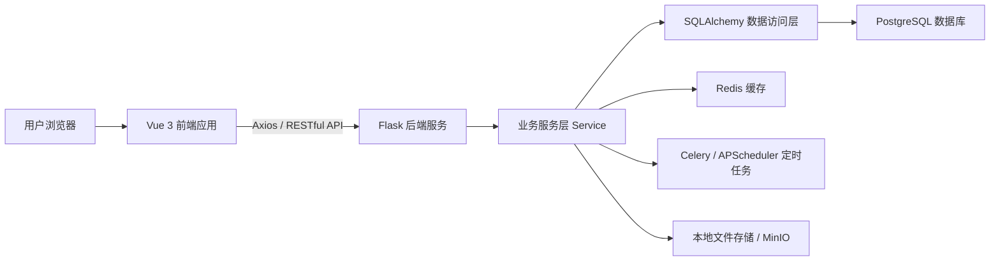
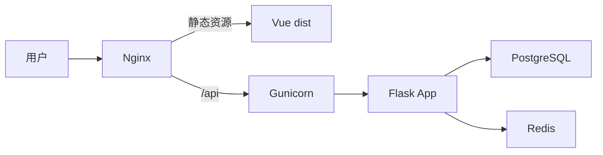

# CompeteHub 系统架构说明

## 零、最终架构决策

经过最后一次架构评估，本项目不采用简单演示式结构，也不在当前阶段拆分为微服务，而采用 **商业项目常用的模块化单体架构 Modular Monolith**。

最终决策如下：

1. **前后端分离**：前端使用 Vue 3，后端使用 Flask，双方通过 RESTful API 通信。
2. **单仓库多子项目**：同一仓库下划分 `frontend/`、`backend/`、`infra/`、`docs/`、`scripts/`。
3. **后端模块化单体**：后端按业务域拆分为 auth、user、competition、recommendation、reminder、forum、admin 等模块。
4. **后端分层设计**：API Route 层只处理请求响应，Service 层处理业务逻辑，Model 层处理数据模型，Common/Core 层处理通用能力。
5. **数据库优先使用 PostgreSQL**：系统核心数据采用关系型建模，保证一致性和可统计性。
6. **Redis 和 Celery 作为增强层**：用于缓存、定时任务、提醒、采集和统计，不把核心业务绑定死在异步任务中。
7. **部署上采用 Nginx + Gunicorn**：Nginx 托管前端并代理 API，Gunicorn 运行 Flask 后端。

该方案比玩具式开发更接近真实商业系统：边界清晰、职责明确、可测试、可部署、可演进；同时又不会过早引入微服务带来的运维复杂度。

## 一、总体结论

本系统建议采用 **前后端分离架构**。

前后端分离的含义是：前端负责页面展示、用户交互和接口调用；后端负责业务逻辑、权限控制、数据处理和数据库访问。前端与后端之间通过 HTTP API 进行通信，双方不直接共享页面渲染逻辑。

对于本课程设计项目，不建议把前端和后端拆成两个完全独立的 Git 仓库。更合适的方式是在同一个项目仓库中划分两个独立目录：

```text
CompeteHub/
  frontend/       # Vue 3 前端项目
  backend/        # Flask 后端项目
  infra/          # Nginx、数据库等部署配置
  scripts/        # 初始化和开发辅助脚本
  docs/           # 需求、技术栈、架构等文档
```

这样既能体现前后端分离，又方便课程设计阶段统一管理、提交和部署。

## 二、整体架构

系统整体采用 Vue 3 前端、Flask 后端、PostgreSQL 数据库、Redis 缓存与异步任务支撑的分层架构。



各层职责如下：

| 层级 | 主要技术 | 职责 |
|---|---|---|
| 前端展示层 | Vue 3、Vite、Element Plus | 页面展示、用户交互、表单校验、接口调用 |
| 后端接口层 | Flask、Blueprint、JWT | 提供 RESTful API，处理认证、权限和请求响应 |
| 业务服务层 | Python Service | 处理注册登录、赛事查询、推荐、提醒、论坛、后台审核等业务逻辑 |
| 数据访问层 | SQLAlchemy | 操作数据库模型，封装数据查询和持久化 |
| 数据存储层 | PostgreSQL | 存储用户、赛事、推荐、论坛、资料、日志等核心数据 |
| 缓存与任务层 | Redis、Celery、APScheduler | 缓存热门数据，执行定时采集、提醒和统计任务 |
| 文件存储层 | 本地文件存储 / MinIO | 存储头像、附件、认证材料、复盘资料等文件 |

## 三、为什么采用前后端分离

本系统功能模块较多，包括用户中心、赛事查询、推荐、提醒、论坛和后台管理。如果前后端混合开发，页面逻辑、接口逻辑和数据库逻辑容易耦合，不利于维护。

采用前后端分离后，有以下优点：

1. 前端可以专注实现页面、交互和用户体验。
2. 后端可以专注实现业务逻辑、权限控制和数据处理。
3. 前后端通过 API 对接，边界清晰，便于分工。
4. 后续如果扩展移动端、小程序或管理端，可以复用后端接口。
5. 课程答辩时架构清晰，容易说明系统层次和模块职责。

需要注意的是，前后端分离不等于必须使用两个仓库。课程设计阶段采用一个仓库下的两个目录即可。

## 四、项目目录结构

建议项目目录如下：

```text
CompeteHub/
  frontend/
    package.json
    vite.config.js
    index.html
    .env.development
    .env.production
    src/
      main.ts
      App.vue
      router/
        index.ts
      stores/
        auth.ts
        user.ts
        competition.ts
      api/
        request.ts
        auth.ts
        user.ts
        competition.ts
        recommendation.ts
        reminder.ts
        forum.ts
        admin.ts
      layouts/
        MainLayout.vue
        AdminLayout.vue
      views/
        auth/
        user/
        competition/
        recommendation/
        reminder/
        forum/
        admin/
      components/
        common/
        competition/
        forum/
      utils/
        auth.ts
        format.ts
      assets/

  backend/
    run.py
    requirements.txt
    .env.example
    app/
      __init__.py
      config.py
      extensions.py
      common/
        response.py
        errors.py
        decorators.py
        pagination.py
      models/
        user.py
        competition.py
        recommendation.py
        reminder.py
        forum.py
        admin.py
        log.py
      modules/
        auth/
        user/
        competition/
        recommendation/
        reminder/
        forum/
        admin/
        crawler/
      tasks/
        celery_app.py
        scheduled.py
    migrations/
    tests/
    uploads/

  docs/
    需求初步整理.md
    technology stacks.md
    系统架构说明.md
```

## 五、前端架构方案

前端采用 **Vue 3 + Vite + Vue Router + Pinia + Axios + Element Plus**。

### 5.1 前端分层

前端代码建议按以下层次组织：

| 目录 | 职责 |
|---|---|
| `router/` | 页面路由配置和路由守卫 |
| `stores/` | Pinia 状态管理，例如登录状态、用户信息、筛选条件 |
| `api/` | 后端接口封装，统一管理接口路径和请求方法 |
| `views/` | 页面级组件，例如赛事列表页、详情页、推荐页 |
| `components/` | 可复用组件，例如赛事卡片、筛选栏、分页器 |
| `layouts/` | 页面布局，例如普通用户布局和后台管理布局 |
| `utils/` | 工具函数，例如 Token 处理、日期格式化 |
| `assets/` | 静态资源，例如图片、样式文件 |

### 5.2 前端主要页面

前端页面建议与八大需求模块对应：

| 页面模块 | 主要页面 |
|---|---|
| 登录注册 | 登录页、注册页 |
| 用户中心 | 个人资料页、画像维护页、我的收藏、我的订阅 |
| 赛事查询 | 赛事列表页、搜索筛选页、赛事详情页 |
| 价值评估 | 赛事详情中的评分展示、评分依据展示 |
| 订阅提醒 | 个人赛事日历页、提醒设置页 |
| 个性化推荐 | 推荐列表页、推荐理由展示、偏好设置页 |
| 交流论坛 | 帖子列表页、帖子详情页、发帖页、组队页、认证答疑页 |
| 后台管理 | 赛事管理、用户管理、审核管理、评分规则、统计分析 |

### 5.3 前端路由设计

建议路由如下：

```text
/login
/register
/profile
/profile/favorites
/profile/subscriptions

/competitions
/competitions/:id

/recommendations
/recommendations/preferences

/calendar
/reminders/settings

/forum
/forum/posts/:id
/forum/create
/forum/team-up

/admin
/admin/competitions
/admin/users
/admin/reviews
/admin/score-rules
/admin/statistics
```

### 5.4 前端状态管理

Pinia 中建议维护以下 Store：

| Store | 内容 |
|---|---|
| `authStore` | Token、登录状态、角色信息 |
| `userStore` | 用户基本信息、画像信息、兴趣标签 |
| `competitionStore` | 当前筛选条件、赛事列表缓存、热门赛事 |
| `recommendationStore` | 推荐结果、推荐偏好 |
| `reminderStore` | 收藏订阅、提醒设置、日历数据 |

### 5.5 Axios 接口封装

前端所有接口请求统一通过 `src/api/request.ts` 封装。该文件负责：

- 设置 `baseURL`
- 自动携带 JWT Token
- 统一处理响应格式
- 统一处理登录过期、权限不足、参数错误等异常

示例请求流程：

```text
页面组件
  -> api/competition.ts
  -> api/request.ts
  -> Flask 后端接口
  -> 返回统一 JSON
  -> 页面更新数据
```

## 六、后端架构方案

后端采用 **Flask Application Factory + Blueprint 模块化单体架构**。

### 6.1 后端分层

后端建议按以下层次组织：

| 层级 | 职责 |
|---|---|
| Routes | 接收 HTTP 请求，解析参数，返回响应 |
| Service | 处理业务逻辑，例如推荐计算、赛事审核、提醒生成 |
| Model | 定义数据库模型 |
| Common | 统一响应、异常处理、权限装饰器、分页工具 |
| Tasks | 定时任务和异步任务 |

### 6.2 后端模块

后端模块与需求模块对应如下：

| 后端模块 | 对应需求模块 | 职责 |
|---|---|---|
| `auth` | M1 | 注册、登录、JWT 认证 |
| `user` | M1 | 用户资料、画像、兴趣标签、收藏订阅记录 |
| `competition` | M2、M3、M4 | 赛事管理、搜索筛选、详情展示、价值评估 |
| `reminder` | M5 | 订阅提醒、个人日历、提醒设置 |
| `recommendation` | M6 | 个性化推荐、推荐理由、偏好调整 |
| `forum` | M7 | 发帖评论、组队交流、认证答疑、资料沉淀 |
| `admin` | M8 | 用户管理、内容审核、评分规则、统计分析 |
| `crawler` | M2 | 赛事采集、清洗、去重 |

## 七、前后端如何连接

前端与后端通过 RESTful API 连接。

开发环境中：

```text
前端地址：http://localhost:5173
后端地址：http://localhost:5000
接口前缀：http://localhost:5000/api
```

前端 `.env.development` 可配置：

```text
VITE_API_BASE_URL=http://localhost:5000/api
```

前端 Axios 使用该地址作为 `baseURL`。例如：

```text
GET /api/competitions
GET /api/competitions/1
POST /api/auth/login
```

后端需要开启 CORS，允许前端开发地址访问：

```text
允许来源：http://localhost:5173
允许方法：GET、POST、PUT、DELETE、PATCH
允许请求头：Content-Type、Authorization
```

生产环境中，可以使用 Nginx 统一代理：

```text
https://competehub.example.com/        -> 前端静态页面
https://competehub.example.com/api     -> Flask 后端接口
```

这样前端请求 `/api/...` 即可访问后端，不需要暴露后端端口。

## 八、接口对应关系

前端页面与后端接口建议对应如下：

| 前端页面 | 后端接口 | 说明 |
|---|---|---|
| 登录页 | `POST /api/auth/login` | 用户登录 |
| 注册页 | `POST /api/auth/register` | 用户注册 |
| 用户中心 | `GET /api/users/me`、`PUT /api/users/me/profile` | 获取和更新用户资料 |
| 赛事列表页 | `GET /api/competitions` | 搜索、筛选、排序、分页 |
| 赛事详情页 | `GET /api/competitions/{id}` | 获取赛事详情 |
| 收藏赛事 | `POST /api/competitions/{id}/favorite` | 添加收藏 |
| 订阅赛事 | `POST /api/competitions/{id}/subscribe` | 添加订阅 |
| 推荐页 | `GET /api/recommendations` | 获取个性化推荐 |
| 推荐偏好页 | `PUT /api/recommendations/preferences` | 更新推荐偏好 |
| 个人日历页 | `GET /api/reminders/calendar` | 获取个人赛事日历 |
| 提醒设置页 | `PUT /api/reminders/settings` | 修改提醒设置 |
| 论坛列表页 | `GET /api/forum/posts` | 获取帖子列表 |
| 发帖页 | `POST /api/forum/posts` | 发布帖子 |
| 帖子详情页 | `GET /api/forum/posts/{id}` | 获取帖子详情 |
| 评论功能 | `POST /api/forum/posts/{id}/comments` | 发布评论 |
| 后台赛事管理 | `GET /api/admin/competitions`、`PUT /api/admin/competitions/{id}` | 管理赛事 |
| 后台审核 | `GET /api/admin/reviews`、`PUT /api/admin/reviews/{id}` | 审核赛事、帖子、认证 |
| 后台统计 | `GET /api/admin/statistics` | 获取统计数据 |

## 九、认证与权限连接方式

登录成功后，后端返回 JWT Token：

```json
{
  "code": 0,
  "message": "success",
  "data": {
    "access_token": "jwt-token",
    "user": {
      "id": 1,
      "username": "student01",
      "role": "student"
    }
  }
}
```

前端保存 Token，并在后续请求中放入请求头：

```text
Authorization: Bearer jwt-token
```

后端根据 Token 识别当前用户，并通过角色判断是否允许访问对应接口。

角色建议：

| 角色 | 权限 |
|---|---|
| `guest` | 浏览公开赛事和公开帖子 |
| `student` | 收藏、订阅、发帖、评论、维护画像 |
| `verified` | 认证答疑、展示认证标签 |
| `teacher` | 查看部分统计和学生参与情况 |
| `organizer` | 提交或维护自己发布的赛事信息 |
| `admin` | 审核、管理用户、配置规则、查看统计 |

## 十、统一响应格式

后端接口统一返回以下格式：

```json
{
  "code": 0,
  "message": "success",
  "data": {}
}
```

分页接口返回：

```json
{
  "code": 0,
  "message": "success",
  "data": {
    "items": [],
    "total": 100,
    "page": 1,
    "page_size": 10
  }
}
```

错误响应返回：

```json
{
  "code": 40001,
  "message": "参数错误",
  "data": null
}
```

## 十一、开发与部署方式

### 11.1 开发环境

开发阶段前后端分别启动：

```text
frontend:
  npm install
  npm run dev

backend:
  pip install -r requirements.txt
  flask run
```

开发环境访问流程：

```text
浏览器访问 Vue 页面
  -> Vue 通过 Axios 请求 Flask API
  -> Flask 查询 PostgreSQL / Redis
  -> Flask 返回 JSON
  -> Vue 更新页面
```

### 11.2 生产环境

生产环境建议：

```text
Vue 项目打包为静态文件
Nginx 托管前端静态文件
Nginx 将 /api 请求反向代理到 Gunicorn
Gunicorn 运行 Flask 后端
PostgreSQL 存储业务数据
Redis 提供缓存和任务队列支持
```

部署结构如下：



## 十二、课程设计阶段落地顺序

建议先实现主链路，再补充增强功能。

第一阶段：

1. 创建 `frontend/` 和 `backend/` 两个子项目。
2. 完成后端 Flask 项目骨架、配置、统一响应和异常处理。
3. 完成用户注册登录、JWT 认证和角色权限。
4. 完成赛事信息增删改查、搜索筛选和详情展示。
5. 完成前端赛事列表页、详情页、登录注册页。
6. 完成收藏、订阅和基础推荐。
7. 完成后台赛事管理和审核。

第二阶段：

1. 完成个人日历和提醒设置。
2. 完成论坛、组队、认证答疑。
3. 完成资料沉淀和赛后复盘。
4. 完成统计分析。
5. 引入 Redis 缓存、Celery 定时任务和赛事采集。

## 十三、架构总结

本系统采用前后端分离架构，但不需要拆成两个独立仓库。建议在同一个仓库中建立 `frontend/` 和 `backend/` 两个独立子项目。前端使用 Vue 3 负责页面展示和交互，后端使用 Flask 提供 RESTful API，二者通过 Axios 和 JSON 数据进行通信。数据库采用 PostgreSQL，缓存和异步任务采用 Redis 与 Celery，部署时通过 Nginx 统一托管前端并反向代理后端接口。

该架构既能满足课程设计对系统完整性的要求，也便于后续按模块逐步实现和扩展。
